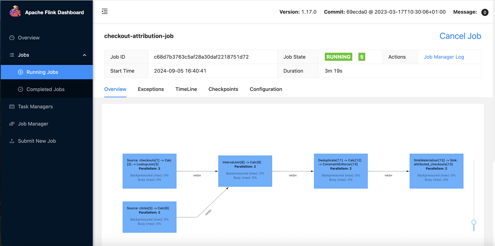

### Table of Contents
   * [Project](#project)
   * [Architecture](#architecture)
   * [Code design](#code-design)
   * [Run streaming job](#run-streaming-job)
   * [Check output](#check-output)
   * [References](#references)
https://github.com/ashm8206/kafka_flink.git

## Project

 A common use case with e-commerce is to identify, for every product purchased, the click that led to its purchase. Attribution is the joining of checkout(purchase) of a product to a click. There are multiple types of **[attribution](https://www.shopify.com/blog/marketing-attribution#3)**; In the project we have used  `First Click Attribution`.

### Project Outcomes:
 1. Identify which click leads to a checkout (aka attribution). For every product checkout, we consider **the earliest click a user made on that product in the previous hour to be the click that led to a checkout**.
 2. Enrich checkout data with the user information. The user data is often a SCD table in a transactional database.
 3. Log the checkouts and their corresponding attributed clicks (if any) into another transactional table.

## Architecture

### Components:

1. **`Web Application`**: An E-commerce website generates clicks and checkout event data.
2. **`Asynchronous Queue `**: The clicks and checkout data are sent to their corresponding Kafka topics.
3. **`Stream processing`**:
   1. Flink reads data from the Kafka topics.
   2. The click data is stored in native State Store / RocksDB. Only store click information for the last hour, and we only store one click per user-product combination.
   3. The checkout data is enriched with user information by querying the user table of any variant MySQL or Postgres. We use Postgres.
   4. The checkout data is left joined with the click data( in the cluster state) to see if the checkout can be attributed to a click.
5. The enriched and attributed checkout data is logged into a Postgres sink table.
4. **`Monitoring & Alerting`**: Apache Flink metrics are pulled by Prometheus and visualized using Grafana.


## Code design

We use Apache Table API to

1. Define Source systems: **[clicks, checkouts and users](https://github.com/ashm8206/kafka_flink/tree/main/code/source)
**[This python script](https://github.com/ashm8206/kafka_flink/blob/main/datagen/gen_fake_data.py) generates fake click and checkout data.**
3. Define how to process the data (enrich and attribute): **[Enriching with user data and attributing checkouts ](https://github.com/ashm8206/kafka_flink/blob/main/code/process/attributed_checkouts.sqll)**
4. Define Sink system: **[sink](https://github.com/ashm8206/kafka_flink/blob/main/code/sink/attributed_checkouts.sql)**

The function **[run_checkout_attribution_job for Flink](https://github.com/ashm8206/kafka_flink/blob/main/code/checkout_attribution.py)** creates the sources, and sink and runs the data processing.

We store the SQL DDL and DML in the folders `source`, `process`, and `sink` corresponding to the above steps.**The code is available [here](https://github.com/ashm8206/kafka_flink).**

## Run streaming job

Clone and run the streaming job (via terminal) as shown below:

```bash
git clone https://github.com/ashm8206/kafka_flink
cd kafka_flink
make run # restart all containers, & start streaming job
```

1. **Apache Flink UI**: Open [http://localhost:8081/](http://localhost:8081/) or run `make ui` and click on `Jobs -> Running Jobs -> checkout-attribution-job` to see our running job.
2. **Grafana**: Visualize system metrics with Graphana, use the `make open` command or go to [http://localhost:3000](http://localhost:3000) via your browser (username: `admin`, password:`flink`).

**Note**: Checkout [Makefile](https://github.com/ashm8206/kafka_flink/blob/main/Makefile) to see how/what commands are run. Use `make down` to spin down the containers.

## Check output

Once we start the job, it will run asynchronously. We can check the Flink UI ([http://localhost:8081/](http://localhost:8081/) or `make ui`) and clicking on `Jobs -> Running Jobs -> checkout-attribution-job` to see our running job.



We can check the output of our job, by looking at the attributed checkouts.

Open a postgres terminal as shown below.

```bash
pgcli -h localhost -p 5432 -U postgres -d postgres
# password: postgres
```

Use the below query to check that the output updates every few seconds.

```sql
SELECT checkout_id, click_id, checkout_time, click_time, user_name FROM commerce.attributed_checkouts order by checkout_time desc limit 5;
```

## References

1. [Apache Flink docs](https://nightlies.apache.org/flink/flink-docs-release-1.17/)
2. [Flink Prometheus example project](https://github.com/mbode/flink-prometheus-example)
